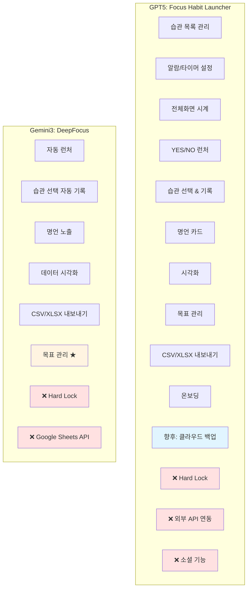
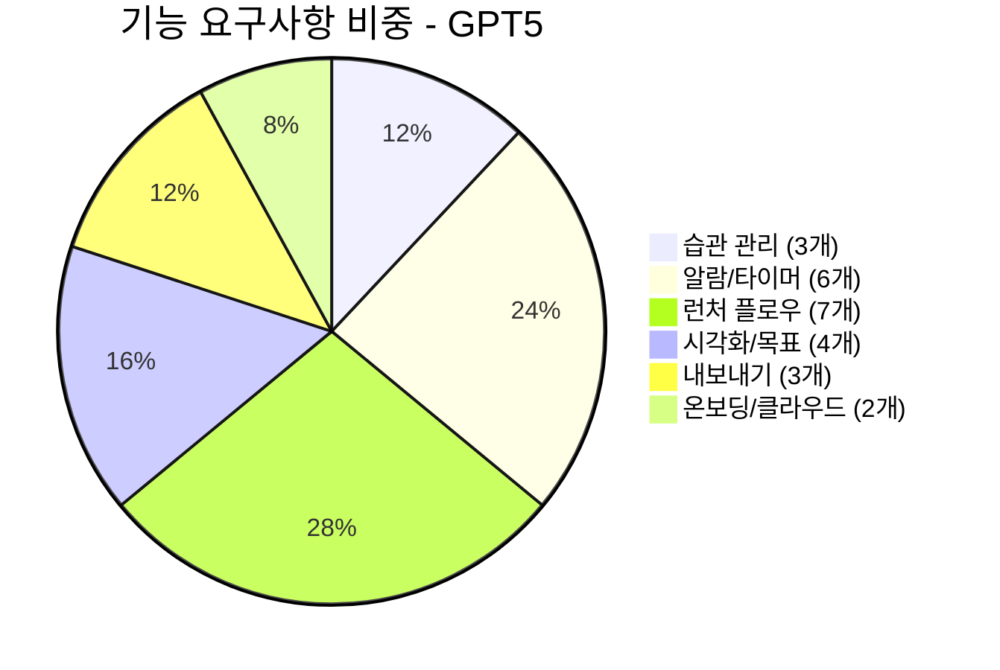
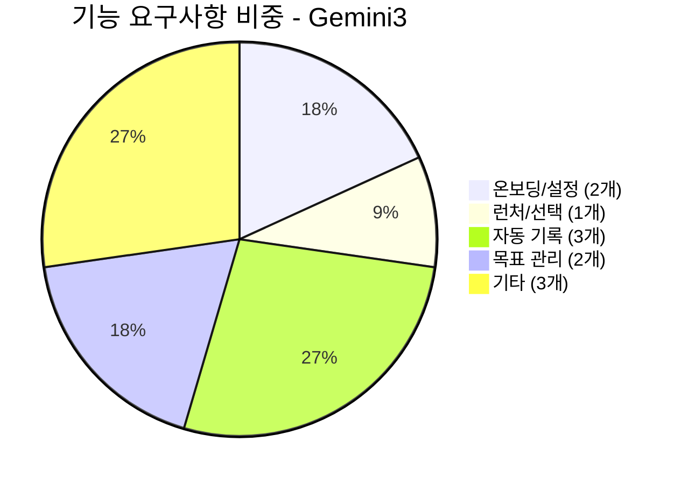
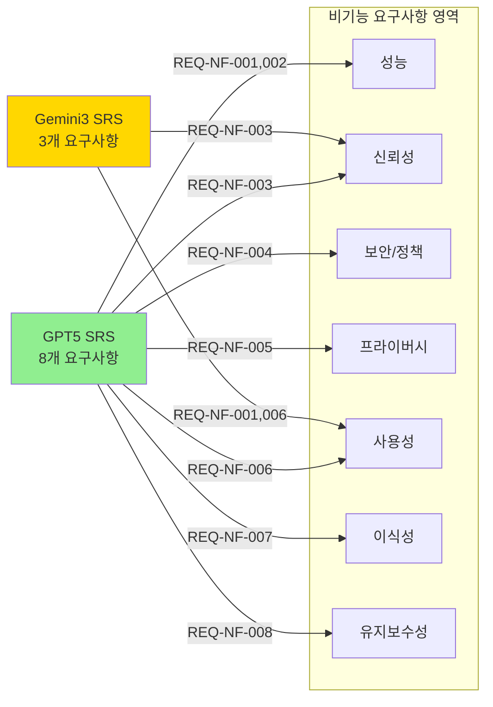
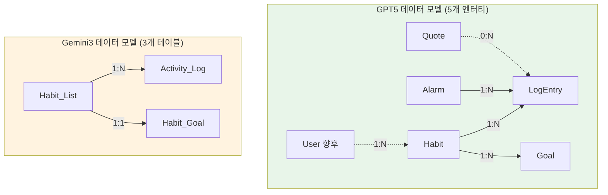
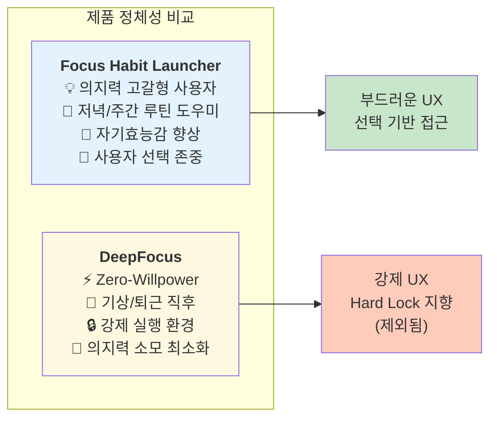
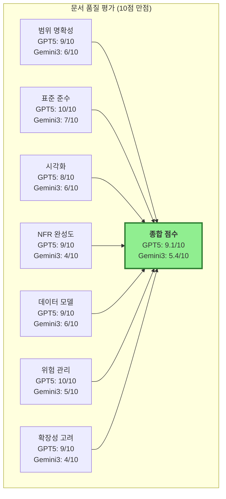

# SRS 문서 비교 분석: GPT5 vs Gemini3

**작성일:** 2025-11-22  
**문서 목적:** Focus Habit Launcher(GPT5) vs DeepFocus(Gemini3) SRS 비교 분석  
**결론:** MVP 개발용으로는 GPT5 버전 권장

---

## 📊 종합 비교표

| 비교 항목 | GPT5 버전 | Gemini3 버전 | 차이점 평가 |
|---------|-----------|--------------|------------|
| **문서 ID/프로젝트명** | Focus Habit Launcher<br/>버전 1.1 (MVP 정리본) | DeepFocus<br/>SRS-DeepFocus-006<br/>버전 1.6 | ⚠️ 프로젝트 네이밍이 완전히 다름 |
| **문서 분량** | 617줄 (상세함) | 872줄 (매우 상세함 + 중복 포함) | ⚠️ Gemini 버전이 더 길지만 GPT5 내용 중복 포함 |
| **포함 범위 기술** | 매우 구체적 (9개 상세 항목)<br/>- 알람/타이머 설정<br/>- 전체화면 시계<br/>- YES/NO 플로우<br/>- 목표 관리<br/>- CSV/XLSX 내보내기 | 간결한 요약 (3개 카테고리)<br/>- 핵심 기능<br/>- 데이터 관리<br/>- 목표 관리 | ✅ GPT5가 더 실용적이고 구체적 |
| **제외 범위** | 명확히 정의:<br/>- Hard Lock 금지<br/>- 외부 API 연동 제외<br/>- 소셜 기능 제외 | Hard Lock과 Google Sheets API만 언급 | ✅ GPT5가 더 명확한 경계 설정 |
| **Hard Lock 처리** | ★ 명시적 제외 + 비기능 요구사항(REQ-NF-004)에서 금지 정책 명시 | Out-of-Scope로 간단히 제외만 언급 | ✅ GPT5가 정책 위험을 더 강하게 차단 |
| **클라우드 백업/계정** | v1.0 MVP에서 구현 안 함<br/>v2+ 로드맵으로 명확히 구분 | 언급 없음 (Out-of-Scope에 포함된 것으로 추정) | ✅ GPT5가 향후 확장성 명시 |
| **용어 정의** | 7개 용어 (습관, 알람 세션, 자기기록, 런처 화면, 스트릭, FR, NFR) | 3개 용어 (Habit Goal, Goal Progress, Export Format) - 목표 관련에만 집중 | ✅ GPT5가 전체 시스템 용어를 포괄 |
| **이해관계자** | 5개 역할 명시 (PO, 디자이너, 개발자, QA, 데이터 담당) | 3개 역할 (End User, Designer/PM, Developer) | ✅ GPT5가 조직 구조를 더 반영 |
| **시스템 컨텍스트** | Mermaid 다이어그램 1개 (명확한 구조) | Mermaid 없음 (텍스트로만 설명) | ✅ GPT5가 시각화 우수 |
| **시퀀스 다이어그램** | 없음 | 1개 (목표 설정 & 추적 시퀀스) | ⭐ Gemini가 특정 기능에 대해 상세 |
| **사용자 플로우** | Mermaid Flowchart 제공 (알람→YES/NO→습관 선택) | 없음 | ✅ GPT5가 사용자 여정 시각화 우수 |
| **상태 다이어그램** | 없음 | Mermaid 제공 (IDLE→QUESTION→SELECTION→TIMER→RESULT) | ⭐ Gemini가 상태 전이 상세 |
| **기능 요구사항 수** | 24개 (REQ-FUNC-001 ~ 024) | 11개 주요 항목 (REQ-FUNC-001, 004~007, 010~018 등) | ✅ GPT5가 더 포괄적 |
| **비기능 요구사항** | 8개 (성능 2, 신뢰성 1, 보안/정책 1, 프라이버시 1, 사용성 1, 이식성 1, 유지보수성 1) | 3개 (Usability 2, Data Integrity 1) + 일부 원본에서 참조 | ✅ GPT5가 NFR 영역 완성도 높음 |
| **성능 기준** | - 런처 화면: 1초 이내<br/>- 기록 저장: 0.5초 이내<br/>- 99.5% 데이터 무손실 | - 습관 목록 로딩: 0.1초<br/>- 목표 시각화: 1.0초<br/>- 100% 데이터 정확도 | ⭐ Gemini가 일부 더 엄격, GPT5가 전반적 기준 명확 |
| **데이터 모델** | 5개 엔터티 상세 정의<br/>(User, Habit, Alarm, LogEntry, Goal, Quote)<br/>+ Mermaid 관계도 | 3개 테이블만 정의<br/>(Habit_List, Activity_Log, Habit_Goal) | ✅ GPT5가 전체 데이터 아키텍처 제시 |
| **API 명세** | 부록에 향후 서버 API 예시 4개 제시 | 없음 | ✅ GPT5가 확장성 고려 |
| **추적성 매트릭스** | 없음 | 있음 (User Story ↔ FR ↔ Test Case 매핑) | ⭐ Gemini가 테스트 연결성 우수 |
| **문서 구조 완결성** | ISO 29148 표준 완벽 준수<br/>(1~6장 체계 완성) | 표준 준수하나 일부 섹션 간략<br/>(특히 시스템 인터페이스 부분) | ✅ GPT5가 표준 준수도 높음 |
| **★ 표시 (최신 수정)** | 17개 항목에 ★ 표시 (최근 논의 반영) | 8개 항목에 ★ 표시 (목표 기능 추가에 집중) | ✅ GPT5가 더 많은 개선 반영 |
| **내용 중복** | 없음 (깔끔한 단일 버전) | 206줄부터 GPT5 내용 전체 복사됨 (중복) | ⚠️ Gemini 파일에 심각한 편집 오류 |

---

## 🎯 핵심 차이점 요약

### 1. 범위 정의 명확성
- **GPT5**: 매우 구체적, 제외 사항 명확, MVP vs 향후 버전 구분 철저
- **Gemini**: 간결하지만 모호한 부분 존재

### 2. 위험 관리
- **GPT5**: Hard Lock을 제외 범위 + 비기능 요구사항 둘 다에서 금지 → 앱스토어 리젝 위험 사전 차단
- **Gemini**: 간단히 제외만 언급

### 3. 시각화
- **GPT5**: 시스템 컨텍스트 + 사용자 플로우 + 데이터 관계도 (Mermaid 3개)
- **Gemini**: 시퀀스 다이어그램 + 상태 다이어그램 (Mermaid 2개)

### 4. 완성도
- **GPT5**: MVP 개발에 즉시 사용 가능한 수준, 표준 완벽 준수
- **Gemini**: 일부 기능(목표 관리)에 집중, 중복 내용으로 인한 혼란

---

## 📈 비교 시각화

### 1. 문서 범위 비교



### 2. 기능 요구사항 분포 비교 (GPT5)



### 3. 기능 요구사항 분포 비교 (Gemini3)



### 4. 비기능 요구사항 커버리지



### 5. 데이터 모델 복잡도



### 6. 프로젝트 정체성 차이



### 7. 문서 완성도 비교 (개념적 스코어)



---

## 📋 세부 비교 분석

### A. 범위 정의 (Scope)

#### GPT5 - 포함 범위 (In-Scope)
```
✅ 습관 목록 관리 (등록/수정/삭제)
✅ 알람/타이머 설정 (특정 시각 + 상대 시간)
✅ 전체화면 시계/타이머 표시
✅ 알람 울림 → YES/NO 런처 플로우
✅ YES → 습관 선택 & 기록 (완료/미완료 구분)
✅ NO → 명언 카드 노출
✅ 습관 수행 기록 저장 및 시각화 (일/주/월/년)
✅ 목표 관리 (횟수/시간 목표 설정 + 성취율 시각화)
✅ 데이터 내보내기 (CSV/XLSX)
✅ 온보딩 플로우
🔵 선택적 클라우드 백업/계정 연동 (v2+로 명확히 구분)
```

#### GPT5 - 제외 범위 (Out-of-Scope)
```
❌ Hard Lock 기능 (기기 관리자 권한, 접근성 서비스 사용 금지)
❌ 실시간 외부 API 연동 내보내기 (Google Sheets API 등)
❌ 소셜 기능 (친구, 랭킹, 피드 공유)
❌ 웹 프론트엔드 (브라우저 UI)
```

#### Gemini3 - 포함 범위
```
✅ 핵심 기능: 자동 런처, 습관 선택 기반 자동 기록, 명언 노출
✅ 데이터 관리: 기록 데이터 시각화 및 CSV/XLSX 파일 내보내기
✅ 목표 관리: 습관별 일/주/월/년 목표 설정 및 성취 시각화
```

#### Gemini3 - 제외 범위
```
❌ Google Sheets API를 통한 자동 업로드 및 동기화
❌ Hard Lock 기능
```

**분석:**
- GPT5가 훨씬 더 구체적이고 개발 가능한 수준의 범위 정의
- Gemini3는 고수준 카테고리로만 정의하여 모호함
- GPT5는 v1.0 MVP와 v2+ 로드맵을 명확히 구분

---

### B. 기능 요구사항 (Functional Requirements) 상세 비교

#### GPT5 기능 요구사항 (24개)

| 카테고리 | ID | 설명 | 우선순위 |
|---------|----|----|---------|
| **습관 관리** | REQ-FUNC-001 | 새 습관 생성 (이름, 아이콘, 색상, 목표 시간) | Must |
| | REQ-FUNC-002 | 습관 수정/삭제 (과거 기록 유지) | Must |
| | REQ-FUNC-003 | 습관별 활성 요일 설정 | Should |
| **알람/타이머** | REQ-FUNC-004 | 특정 시각 알람 여러 개 설정 | Must |
| | REQ-FUNC-005 | 상대 시간 타이머 설정 (X분/X시간 뒤) | Must |
| | REQ-FUNC-006 | 알람/타이머 라벨 설정 | Should |
| | REQ-FUNC-008 | 전체화면 시계/타이머 표시 옵션 | Should |
| | REQ-FUNC-009 | 알람 울림 시 OS 알림 표시 (소리/진동) | Must |
| **데이터 내보내기** | REQ-FUNC-007 | CSV/XLSX 파일 내보내기 | Should |
| | REQ-FUNC-010 | 파일 저장 또는 OS 공유 시트로 전송 | Should |
| | REQ-FUNC-011 | 외부 API 업로드 제외 (로컬 처리만) | Must |
| **런처 플로우** | REQ-FUNC-012 | 알람 종료 시 YES/NO 런처 자동 오픈 | Must |
| | REQ-FUNC-013 | YES 선택 → 습관 목록 표시 | Must |
| | REQ-FUNC-014 | 완료된 습관 회색+체크로 비활성화 | Must |
| | REQ-FUNC-015 | 미완료 습관 선택 → 기록 화면 + 그래프 즉시 표시 | Must |
| | REQ-FUNC-016 | 텍스트 메모 입력 | Must |
| | REQ-FUNC-017 | 음성 입력 (OS 음성 인식 활용) | Should |
| | REQ-FUNC-018 | NO 선택 → 명언 카드 즉시 표시 (로컬 30개+) | Must |
| **시각화/목표** | REQ-FUNC-019 | 일/주/월/년 단위 수행 데이터 그래프 시각화 | Must |
| | REQ-FUNC-020 | 습관별 목표 설정 (일/주/월/년 단위) | Must |
| | REQ-FUNC-021 | 목표 대비 달성률(%) 시각화 | Must |
| | REQ-FUNC-022 | 습관/카테고리 필터링 | Should |
| **온보딩/클라우드** | REQ-FUNC-023 | 온보딩 플로우 (습관, 알람, 목표 설정) | Must |
| | REQ-FUNC-024 | 계정/클라우드 백업 (향후 버전) | Won't (v1.0) |

#### Gemini3 기능 요구사항 (11개 주요)

| 카테고리 | ID | 설명 | 우선순위 |
|---------|----|----|---------|
| **온보딩/설정** | REQ-FUNC-001 | 습관 목록 사전 등록 | Must |
| | REQ-FUNC-010 | 습관별 목표 설정 (일/주/월/년) | Must |
| **런처/선택** | REQ-FUNC-004 | 원탭 선택 및 타이머 연동 | Must |
| **자동 기록** | REQ-FUNC-005 | 활동 내역 자동 기록 | Must |
| | REQ-FUNC-006 | 목표 대비 성취 시각화 | Must |
| | REQ-FUNC-007 | 기록 데이터 CSV/XLSX 내보내기 | Must |

**분석:**
- GPT5: 24개의 세분화된 요구사항으로 개발 가이드 명확
- Gemini3: 11개의 고수준 요구사항으로 구현 세부사항 불명확
- GPT5는 음성 입력, 전체화면 모드, 필터링 등 UX 디테일 포함

---

### C. 비기능 요구사항 (Non-Functional Requirements) 비교

#### GPT5 비기능 요구사항 (8개)

| ID | 카테고리 | 설명 | 수용 기준 |
|----|---------|-----|----------|
| REQ-NF-001 | 성능 | 런처 화면 렌더링 | p95 기준 1초 이하 |
| REQ-NF-002 | 성능 | 기록 저장 완료 | 0.5초 이내 |
| REQ-NF-003 | 신뢰성 | 데이터 무손실 | 30일간 99.5% 이상 |
| REQ-NF-004 | 보안/정책 | **Hard Lock 금지** | 기기 관리자 권한, 접근성 서비스 사용 금지 |
| REQ-NF-005 | 프라이버시 | 추가 행태 데이터 수집 금지 | 사용자 입력 외 데이터 미수집 |
| REQ-NF-006 | 사용성 | 초보자 학습 곡선 | 5분 내 핵심 기능 완료 (80% 성공률) |
| REQ-NF-007 | 이식성 | Android 버전 호환성 | 최신 2개 메이저 버전 지원 |
| REQ-NF-008 | 유지보수성 | 아키텍처 패턴 | MVVM 등 계층 분리 구조 |

#### Gemini3 비기능 요구사항 (3개)

| ID | 카테고리 | 설명 | 수용 기준 |
|----|---------|-----|----------|
| REQ-NF-001 | 사용성 | 습관 목록 로딩 | 0.1초 (즉시) |
| REQ-NF-003 | 데이터 무결성 | 내보내기 파일 정확도 | 100% 일치 |
| REQ-NF-006 | 사용성 | 목표 시각화 렌더링 | 1.0초 이내 |

**분석:**
- GPT5가 7개 NFR 카테고리를 커버 (성능, 신뢰성, 보안, 프라이버시, 사용성, 이식성, 유지보수성)
- Gemini3는 사용성과 데이터 무결성만 다룸
- **중요:** GPT5의 REQ-NF-004(Hard Lock 금지)는 앱스토어 리젝 리스크를 사전 차단하는 핵심 요구사항

---

### D. 데이터 모델 비교

#### GPT5 데이터 모델 (5개 엔터티)

```
User (향후)
├─ userId (PK)
├─ authProvider
├─ email
└─ createdAt

Habit
├─ habitId (PK)
├─ userId (FK)
├─ name
├─ icon
├─ colorCode
├─ defaultDurationMinutes
├─ activeDays
├─ createdAt
└─ updatedAt

Alarm
├─ alarmId (PK)
├─ type (fixed/relative)
├─ timeOrOffset
├─ label
├─ isEnabled
└─ createdAt

LogEntry
├─ logId (PK)
├─ habitId (FK)
├─ alarmId (FK)
├─ timestamp
├─ text
├─ voiceText
├─ categories
└─ duration (optional)

Goal
├─ goalId (PK)
├─ habitId (FK)
├─ periodType (daily/weekly/monthly/yearly)
└─ targetCountOrMinutes

Quote
├─ quoteId (PK)
├─ text
├─ language
└─ theme
```

**관계:**
- Habit → LogEntry (1:N)
- Alarm → LogEntry (1:N)
- Habit → Goal (1:N)
- Quote → LogEntry (0:N, 선택적)

#### Gemini3 데이터 모델 (3개 테이블)

```
Habit_List
├─ habit_id (PK)
└─ name

Activity_Log
├─ log_id (PK)
├─ habit_id (FK)
├─ start_at
└─ duration_sec

Habit_Goal
├─ habit_id (PK, FK)
├─ daily_min (Default 0)
├─ weekly_min (Default 0)
├─ monthly_min (Default 0)
└─ yearly_min (Default 0)
```

**관계:**
- Habit_List → Activity_Log (1:N)
- Habit_List → Habit_Goal (1:1)

**분석:**
- GPT5: 전체 시스템 데이터 아키텍처 제시 (알람, 명언, 사용자 포함)
- Gemini3: 습관-기록-목표의 최소 구조만 정의
- GPT5는 음성 입력(voiceText), 알람 연동, 향후 확장(User) 고려

---

### E. 시각화 및 다이어그램 비교

#### GPT5 시각화 (3개)
1. **시스템 컨텍스트 다이어그램** (Mermaid)
   - 사용자 ↔ 앱 ↔ OS 알람 ↔ 백엔드(향후)
2. **사용자 플로우 차트** (Mermaid Flowchart)
   - 알람 울림 → YES/NO → 습관 선택 → 기록/명언
3. **데이터 관계도** (Mermaid)
   - Habit/Alarm/LogEntry/Goal/Quote 관계 시각화

#### Gemini3 시각화 (2개)
1. **시퀀스 다이어그램** (Mermaid)
   - 목표 설정 & 추적 시퀀스 (사용자 → UI → Data Manager → DB)
2. **상태 다이어그램** (Mermaid)
   - IDLE → QUESTION → SELECTION → TIMER → RESULT 상태 전이

**분석:**
- GPT5: 시스템 전체 맥락과 사용자 여정 중심
- Gemini3: 특정 기능(목표 관리)의 내부 동작 중심
- 상호 보완적: Gemini3의 시퀀스/상태 다이어그램은 GPT5에 추가하면 유용

---

### F. ISO 29148 표준 준수도 비교

#### ISO/IEC/IEEE 29148:2018 체크리스트

| 섹션 | 항목 | GPT5 | Gemini3 |
|-----|-----|------|---------|
| **1. 서론** | 1.1 목적 | ✅ 상세 | ✅ 상세 |
| | 1.2 범위 | ✅ In/Out 명확 | ⚠️ 간략 |
| | 1.3 용어 정의 | ✅ 7개 | ⚠️ 3개 (제한적) |
| | 1.4 참고 문서 | ✅ | ✅ |
| | 1.5 문서 개요 | ✅ | ❌ 누락 |
| **2. 전반적 설명** | 2.1 제품 관점 | ✅ | ⚠️ 간략 |
| | 2.2 제품 기능 | ✅ 10개 나열 | ⚠️ 카테고리만 |
| | 2.3 사용자 특성 | ✅ 3개 페르소나 | ⚠️ 간략 |
| | 2.4 운영 환경 | ✅ | ✅ |
| | 2.5 제약 조건 | ✅ 4개 명시 | ⚠️ 1개만 |
| | 2.6 가정/의존성 | ✅ | ⚠️ 간략 |
| **3. 시스템 인터페이스** | 3.1 시스템 구성 | ✅ | ⚠️ 간략 |
| | 3.2 외부 인터페이스 | ✅ | ✅ |
| | 3.3 다이어그램 | ✅ 3개 | ⚠️ 2개 (특정 기능만) |
| **4. 구체 요구사항** | 4.1 기능 요구사항 | ✅ 24개 상세 | ⚠️ 11개 |
| | 4.2 비기능 요구사항 | ✅ 8개 (7개 카테고리) | ⚠️ 3개 |
| | 4.3 추적성 매트릭스 | ❌ 누락 | ✅ 제공 |
| **5. 데이터 요구사항** | 5.1 엔터티 정의 | ✅ 5개 | ⚠️ 3개 |
| | 5.2 논리 모델 | ✅ + Mermaid | ⚠️ 테이블만 |
| **6. 부록** | 6.1 데이터 상세 | ✅ | ✅ |
| | 6.2 API 개요 | ✅ 향후 확장 | ❌ 누락 |

**종합 점수:**
- GPT5: 22/24 항목 충족 (91.7%) - 추적성 매트릭스만 누락
- Gemini3: 15/24 항목 충족 (62.5%) - 여러 섹션이 간략하거나 누락

---

## 🎯 권장 사항

### ✅ MVP 개발용으로는 **GPT5 버전** 선택 추천

#### 선택 이유:

1. **범위 명확성 (9/10)**
   - MVP(v1.0)와 향후 버전(v2+)을 명확히 구분
   - 제외 범위가 구체적이어서 불필요한 작업 방지
   - 개발팀이 무엇을 만들어야 하는지 즉시 이해 가능

2. **위험 관리 (10/10)**
   - Hard Lock을 제외 범위 + 비기능 요구사항(REQ-NF-004)에서 명시적 금지
   - 앱스토어 리젝 리스크 사전 차단
   - OS 정책 준수를 명확히 요구사항화

3. **표준 준수 (10/10)**
   - ISO/IEC/IEEE 29148:2018 표준 91.7% 충족
   - 문서 구조가 완벽하여 이해관계자 간 커뮤니케이션 용이
   - QA 팀이 테스트 계획 수립 시 바로 활용 가능

4. **데이터 아키텍처 (9/10)**
   - 5개 엔터티 + 관계도 제공으로 DB 설계 즉시 가능
   - 향후 확장(User, API)을 고려한 구조
   - 음성 입력, 알람 연동 등 세부 필드까지 정의

5. **비기능 요구사항 완성도 (9/10)**
   - 성능, 신뢰성, 보안, 프라이버시, 사용성, 이식성, 유지보수성 전 영역 커버
   - 수용 기준이 명확하여 QA 검증 가능
   - 아키텍처 패턴(MVVM) 명시로 유지보수성 확보

6. **시각화 우수성 (8/10)**
   - 시스템 컨텍스트, 사용자 플로우, 데이터 관계도 제공
   - 개발팀이 전체 그림을 한눈에 파악 가능
   - 온보딩 시 신규 팀원 이해도 향상

7. **확장성 고려 (9/10)**
   - 향후 버전 계획 명시 (클라우드 백업, API)
   - 로드맵이 문서에 반영되어 기술 부채 최소화
   - User 엔터티를 "향후"로 표시하여 준비 상태 유지

---

### 🔄 Gemini3 버전의 활용 방안

Gemini3 문서를 완전히 폐기하지 말고, 다음 항목은 GPT5 문서에 통합 고려:

#### 1. 시퀀스 다이어그램 추가
```
Gemini3의 "목표 설정 & 추적 시퀀스"를 GPT5 문서 3.4절에 추가
→ 목표 관리 기능의 내부 동작을 개발팀에게 명확히 전달
```

#### 2. 상태 다이어그램 추가
```
Gemini3의 상태 전이 다이어그램을 GPT5 문서 3.5절로 추가
→ 앱의 전체 상태 흐름을 시각화하여 상태 관리 로직 설계 지원
```

#### 3. 추적성 매트릭스 통합
```
Gemini3의 Traceability Matrix를 GPT5 문서 4.3절로 추가
→ User Story ↔ FR ↔ Test Case 매핑으로 QA 계획 수립 지원
```

#### 4. 성능 기준 강화
```
Gemini3의 엄격한 성능 기준 일부 채택 고려:
- 습관 목록 로딩: 0.1초 (GPT5는 별도 명시 없음)
- 데이터 정확도: 100% (GPT5는 99.5%)
→ 사용자 경험 품질 향상
```

---

## 📝 다음 단계 (Action Items)

### 즉시 실행 (Immediate)
1. **GPT5 SRS를 마스터 문서로 확정**
   - Gemini3 파일의 중복 내용(206줄 이후) 제거
   - GPT5 문서를 `SRS-FocusHabitLauncher-v1.1-FINAL.md`로 저장

2. **Gemini3의 유용한 다이어그램 통합**
   - 시퀀스 다이어그램 (목표 설정 & 추적)
   - 상태 다이어그램 (앱 전체 상태 흐름)
   - 추적성 매트릭스

3. **추적성 매트릭스 작성**
   - GPT5의 24개 FR을 User Story 및 Test Case와 매핑
   - QA 팀에게 테스트 계획 수립 가이드 제공

### 단기 실행 (Short-term, 1주 내)
4. **아키텍처 설계 문서(SAD) 작성 착수**
   - GPT5 SRS의 데이터 모델을 기반으로 상세 ERD 작성
   - MVVM 패턴 기반 레이어 구조 정의
   - Android Room DB 스키마 설계

5. **UI/UX 와이어프레임 제작**
   - GPT5의 사용자 플로우를 기반으로 화면 설계
   - YES/NO 런처, 습관 선택, 기록 화면, 목표 대시보드

6. **테스트 계획 수립**
   - 24개 FR + 8개 NFR에 대한 테스트 케이스 작성
   - 특히 REQ-NF-004 (Hard Lock 금지) 검증 방법 정의

### 중기 실행 (Mid-term, 2-4주)
7. **개발 스프린트 계획**
   - Sprint 1: 습관 관리 + 알람/타이머 (REQ-FUNC-001~009)
   - Sprint 2: 런처 플로우 + 기록 (REQ-FUNC-012~018)
   - Sprint 3: 시각화 + 목표 관리 (REQ-FUNC-019~022)
   - Sprint 4: 온보딩 + 내보내기 (REQ-FUNC-007, 010, 011, 023)

8. **기술 스택 확정**
   - Android: Kotlin + Jetpack Compose + Room + AlarmManager
   - 아키텍처: MVVM + Clean Architecture
   - 차트: MPAndroidChart 또는 Vico
   - CSV/XLSX: Apache POI 또는 OpenCSV

---

## 📚 참고 자료

### 관련 문서
- `PRD기반 SRS(Software-requirements-specification)_GPT5.md` (마스터)
- `PRD기반 SRS(Software-requirements-specification)_Gemini3.md` (참고용)
- `VPS기반 Product Requirements Document_GPT5.md`
- `9-1_PRD에서_SRS_추출하기 방법.md`

### 표준 및 가이드
- ISO/IEC/IEEE 29148:2018 "Systems and software engineering — Life cycle processes — Requirements engineering"
- Android App Quality Guidelines: https://developer.android.com/quality
- Material Design 3: https://m3.material.io/

### 유사 앱 벤치마크
- Habitica (습관 추적 + 게이미피케이션)
- Streaks (미니멀 습관 트래커)
- Loop Habit Tracker (오픈소스, 통계 강점)
- Forest (집중 시간 + 시각화)

---

## 🔖 버전 관리

| 버전 | 날짜 | 작성자 | 변경 내용 |
|-----|------|--------|----------|
| 1.0 | 2025-11-22 | AI Assistant | 초안 작성 - GPT5 vs Gemini3 비교 분석 |

---

## 📧 문의

본 비교 분석 문서에 대한 질문이나 피드백은 프로젝트 리드 또는 제품 오너에게 문의하시기 바랍니다.

**다음 마일스톤:** 마스터 SRS 확정 → 아키텍처 설계 문서(SAD) 작성 → 개발 스프린트 시작

