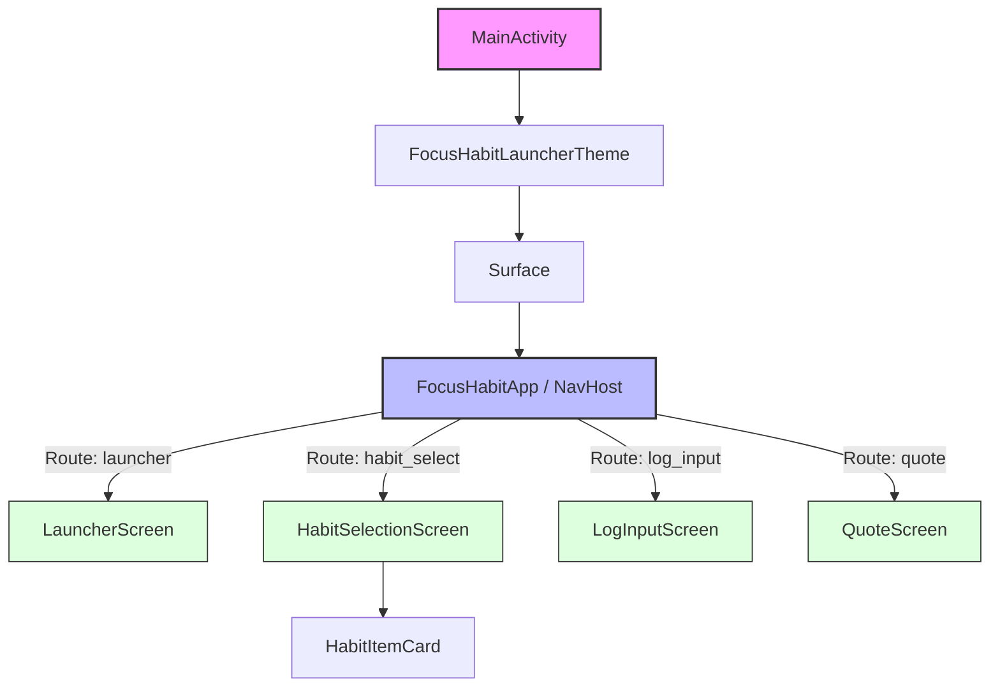

# Focus Habit Launcher

**Digital Wellness & Productivity for the "Willpower-Depleted"**

Focus Habit Launcher는 의지력이 고갈된 현대인(지식 노동자, 수험생 등)을 위해 설계된 **디지털 미니멀리즘 자기계발 런처**입니다. 사용자가 알람을 끌 때 "오늘 했나요?"라는 질문을 던져, 스마트폰 중독을 방지하고 즉시 목표 행동을 실행하도록 돕습니다.

---

## 🎨 디자인 시스템 (Design System)

사용자의 시각적 피로도를 줄이고 몰입감을 높이기 위해 **Dark Mode 중심**의 미니멀한 디자인 언어를 사용합니다.

*   **Color Palette**
    *   **Background**: Dark Gray (`#1E1E1E`) - 눈의 피로 최소화 및 몰입 유도
    *   **Primary**: Focus Purple (`#6C63FF`) - 창의성과 집중을 상징
    *   **Habit Colors**:
        *   🧘 Meditation: `#6C63FF` (Purple)
        *   📚 Reading: `#FF6584` (Pink)
        *   💊 Health: `#43D097` (Green)
        *   🤸 Exercise: `#FFC107` (Amber)
    *   **Status**:
        *   Completed: Gray (`#808080`) + Strike-through
        *   Active: Vibrant Original Colors

*   **Typography**
    *   **Font Family**: System Default (San Francisco / Roboto)
    *   **Hierarchy**: 명확한 정보 전달을 위한 Title(H1) - Body - Caption 구조

*   **Components**
    *   **Habit Card**: 터치 영역을 넓게 확보한 카드형 UI
    *   **Full Screen Overlay**: 시스템 UI를 가리는 몰입형 런처 화면

---

## 📊 데이터 흐름 (Data Flow)

**Local-First Architecture**를 채택하여 네트워크 연결 없이도 모든 로직이 기기 내에서 완결됩니다.

1.  **트리거 (Trigger)**: `AlarmManager`가 지정된 시각에 알람 이벤트를 발생시킵니다.
2.  **런처 실행 (Overlay)**: `BroadcastReceiver`가 알람을 감지하여 잠금 화면 위에 `LauncherActivity`를 오버레이로 띄웁니다.
3.  **사용자 입력 (Input)**: 사용자의 YES/NO 선택 및 기록 데이터(텍스트/음성)가 입력됩니다.
4.  **로컬 저장 (Storage)**: 입력된 데이터는 즉시 `Room Database` (SQLite)에 영구 저장됩니다.
5.  **시각화 & 내보내기 (Output)**: 저장된 데이터는 실시간으로 그래프(`Canvas`/`Vico`)로 렌더링되거나 CSV 파일로 추출됩니다.

---

## 🔑 핵심 UX 특징 (Core UX Features)

1.  **강제적 개입 (Intervention)**: 알람 해제 시 사용자의 의지와 상관없이 런처가 실행되어 스마트폰 사용 패턴을 '소비'에서 '생산'으로 전환합니다.
2.  **인지 부하 최소화 (Binary Choice)**: 복잡한 메뉴 대신 **YES / NO** 두 가지 선택지만 제시하여 고민하는 시간을 없앱니다.
3.  **즉각적 보상 (Instant Feedback)**: 기록 저장 직후 그래프 애니메이션을 보여주어 성취감을 즉시 시각화합니다.
4.  **완료의 시각화 (Visual Completion)**: 완료한 습관은 회색으로 비활성화(Gray-out)되어 "오늘 할 일이 줄어들고 있음"을 직관적으로 보여줍니다.
5.  **중단 없는 흐름 (Seamless Flow)**: 알람 → 기록 → 종료까지 불필요한 팝업이나 로딩 없이 하나의 흐름으로 연결됩니다.

---

## 🔄 주요 흐름 (Main Flow)

1.  **설정**: 사용자가 습관(예: 명상)과 알람(예: 오전 7시)을 등록합니다.
2.  **기상/알림**: 지정된 시간에 알람이 울리며 스마트폰 화면 전체가 런처로 전환됩니다.
3.  **선택**:
    *   **YES**: 습관 목록 화면으로 진입하여 수행한 활동을 선택합니다.
    *   **NO**: 동기 부여 명언 카드를 확인하고 앱이 종료됩니다.
4.  **기록**: 선택한 습관에 대해 간단한 메모나 음성 기록을 남깁니다.
5.  **완료**: 수행 결과가 그래프에 반영되고, 런처가 종료되며 원래의 스마트폰 화면으로 돌아갑니다.

---

## 🛠 기술 스택 (Tech Stack)

*   **Language**: Kotlin (100%)
*   **UI Framework**: Jetpack Compose (Material3)
*   **Architecture**: MVVM + Clean Architecture
*   **Local DB**: Room (SQLite)
*   **OS Integration**: AlarmManager, Notification, System Alert Window

---

## 🌳 Component Tree



---

## 🚀 시작하기 (Getting Started)

1.  **필수 요구사항**: Android Studio Ladybug 이상, JDK 17, Android SDK 34
2.  **설치**:
    ```bash
    git clone https://github.com/your-username/focus-habit-launcher.git
    ```
3.  **실행**: Android Studio에서 프로젝트 열기 후 `Run` (API 34+ 에뮬레이터 권장)

---

**License**: MIT
