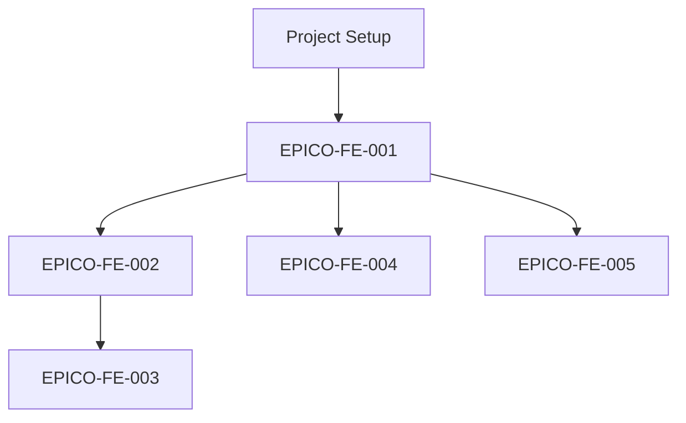
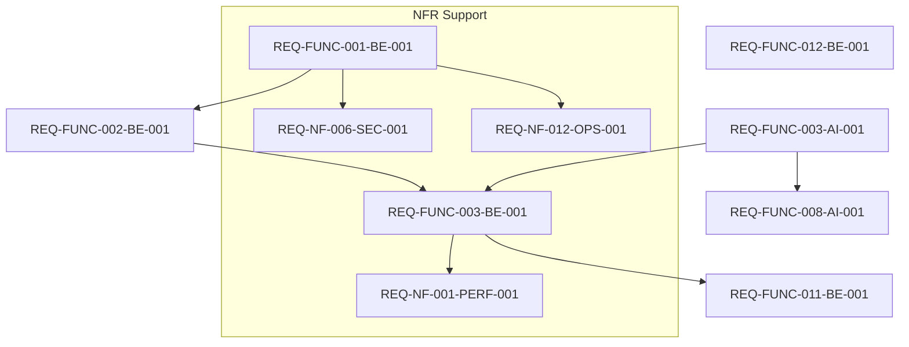
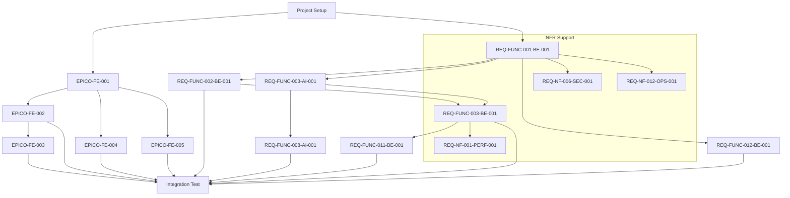

# 통합 WBS 및 DAG 구조

> **참조 문서:** `6-1.MVP개발-Task추출통합작업계획.md` (단계 6, 7)  
> **목적:** MVP 개발 Task의 통합 WBS(Work Breakdown Structure) 및 DAG(Directed Acyclic Graph) 정의  
> **작성일:** 2025-01-XX

---

## 1. 개요

본 문서는 MVP 개발을 위한 모든 Task를 계층적으로 구조화한 **WBS(Work Breakdown Structure)**와 Task 간 의존성을 표현한 **DAG(Directed Acyclic Graph)**를 제공합니다.

### 1.1 WBS 구조

```
레벨 1: Epic
  └─ 레벨 2: Feature
      └─ 레벨 3: REQ-FUNC / REQ-NF
          └─ 레벨 4: 컴포넌트별 구현/테스트 Task
```

### 1.2 DAG 구조

- **노드**: 각 Task (Task ID로 식별)
- **엣지**: Task 간 의존성 (선후행 관계)
- **방향**: 의존성 방향 (A → B: A 완료 후 B 시작 가능)

---

## 2. Flow 1: Basic Setup & UI PoC

프로젝트 초기 설정 및 프론트엔드 프로토타입 개발 플로우입니다.

### 2.1 DAG 다이어그램



### 2.2 Task 상세

#### Project Setup
- **Task ID**: `PROJECT-SETUP-001`
- **설명**: 프로젝트 초기화, 개발 환경 설정, 기본 아키텍처 구성
- **컴포넌트**: Infrastructure, DevOps
- **의존성**: 없음

#### EPICO-FE-001
- **Task ID**: `EPICO-FE-001`
- **설명**: 기본 UI 컴포넌트 라이브러리 및 레이아웃 시스템 구축
- **컴포넌트**: Frontend
- **의존성**: `PROJECT-SETUP-001`
- **관련 REQ**: UI/UX 기본 요구사항

#### EPICO-FE-002
- **Task ID**: `EPICO-FE-002`
- **설명**: 문제정의서 리스트 화면 PoC UI
- **컴포넌트**: Frontend
- **의존성**: `EPICO-FE-001`
- **관련 REQ**: REQ-FUNC-XXX (문제정의서 관련)

#### EPICO-FE-003
- **Task ID**: `EPICO-FE-003`
- **설명**: 문제정의서 상세/편집 화면 PoC UI
- **컴포넌트**: Frontend
- **의존성**: `EPICO-FE-002`
- **관련 REQ**: REQ-FUNC-XXX (문제정의서 관련)

#### EPICO-FE-004
- **Task ID**: `EPICO-FE-004`
- **설명**: JTBD 인터뷰 결과 입력 폼 PoC UI
- **컴포넌트**: Frontend
- **의존성**: `EPICO-FE-001`
- **관련 REQ**: REQ-FUNC-XXX (JTBD 인터뷰 관련)

#### EPICO-FE-005
- **Task ID**: `EPICO-FE-005`
- **설명**: Value Proposition 입력 폼 PoC UI
- **컴포넌트**: Frontend
- **의존성**: `EPICO-FE-001`
- **관련 REQ**: REQ-FUNC-XXX (Value Proposition 관련)

### 2.3 병렬화 가능 영역

- `EPICO-FE-002`, `EPICO-FE-004`, `EPICO-FE-005`는 `EPICO-FE-001` 완료 후 병렬 개발 가능
- `EPICO-FE-003`은 `EPICO-FE-002` 완료 후 시작

---

## 3. Flow 2: Core Backend & AI Implementation

백엔드 핵심 기능 및 AI 엔진 구현 플로우입니다.

### 3.1 DAG 다이어그램



### 3.2 Task 상세

#### REQ-FUNC-001-BE-001
- **Task ID**: `REQ-FUNC-001-BE-001`
- **설명**: 기본 API 엔드포인트 및 인증 시스템 구현
- **컴포넌트**: Backend (Spring Boot)
- **의존성**: `PROJECT-SETUP-001`
- **관련 REQ**: REQ-FUNC-001
- **입력**: 인증 요구사항, API 스펙
- **출력**: 인증 API, 기본 CRUD 엔드포인트

#### REQ-FUNC-002-BE-001
- **Task ID**: `REQ-FUNC-002-BE-001`
- **설명**: 비즈니스 로직 핵심 기능 구현
- **컴포넌트**: Backend (Spring Boot)
- **의존성**: `REQ-FUNC-001-BE-001`
- **관련 REQ**: REQ-FUNC-002
- **입력**: 비즈니스 로직 요구사항, 데이터 모델
- **출력**: 비즈니스 로직 API, 서비스 레이어

#### REQ-FUNC-003-BE-001
- **Task ID**: `REQ-FUNC-003-BE-001`
- **설명**: 핵심 비즈니스 로직 확장 및 데이터 처리
- **컴포넌트**: Backend (Spring Boot)
- **의존성**: `REQ-FUNC-002-BE-001`, `REQ-FUNC-003-AI-001`
- **관련 REQ**: REQ-FUNC-003
- **입력**: 확장된 비즈니스 로직 요구사항, AI 처리 결과
- **출력**: 통합 비즈니스 로직 API

#### REQ-FUNC-003-AI-001
- **Task ID**: `REQ-FUNC-003-AI-001`
- **설명**: AI 엔진 핵심 파이프라인 구현
- **컴포넌트**: AI Engine (FastAPI + LangChain)
- **의존성**: `REQ-FUNC-001-BE-001`
- **관련 REQ**: REQ-FUNC-003
- **입력**: AI 처리 요구사항, LLM 설정
- **출력**: AI 처리 파이프라인, 컨텍스트 관리 시스템

#### REQ-FUNC-008-AI-001
- **Task ID**: `REQ-FUNC-008-AI-001`
- **설명**: PMF(Product-Market Fit) 진단 AI 기능 구현
- **컴포넌트**: AI Engine (FastAPI + LangChain)
- **의존성**: `REQ-FUNC-003-AI-001`
- **관련 REQ**: REQ-FUNC-008
- **입력**: PMF 진단 요구사항, 분석 프레임워크
- **출력**: PMF 진단 API, 분석 리포트 생성

#### REQ-FUNC-011-BE-001
- **Task ID**: `REQ-FUNC-011-BE-001`
- **설명**: 데이터 집계 및 리포트 생성 기능
- **컴포넌트**: Backend (Spring Boot)
- **의존성**: `REQ-FUNC-003-BE-001`
- **관련 REQ**: REQ-FUNC-011
- **입력**: 집계 요구사항, 리포트 템플릿
- **출력**: 데이터 집계 API, 리포트 생성 API

#### REQ-FUNC-012-BE-001
- **Task ID**: `REQ-FUNC-012-BE-001`
- **설명**: 재무(Financial) 모델링 및 계산 엔진 구현
- **컴포넌트**: Backend (Spring Boot)
- **의존성**: `REQ-FUNC-001-BE-001`
- **관련 REQ**: REQ-FUNC-012
- **입력**: 재무 모델 요구사항, 계산 규칙
- **출력**: 재무 계산 API, 3년 P&L/현금흐름 생성

#### REQ-NF-006-SEC-001
- **Task ID**: `REQ-NF-006-SEC-001`
- **설명**: 보안 정책 및 암호화 구현
- **컴포넌트**: Backend (Spring Boot)
- **의존성**: `REQ-FUNC-001-BE-001`
- **관련 REQ**: REQ-NF-006
- **입력**: 보안 요구사항, 암호화 정책
- **출력**: AES-256 암호화, 인증/인가 정책

#### REQ-NF-012-OPS-001
- **Task ID**: `REQ-NF-012-OPS-001`
- **설명**: 운영 모니터링 및 로깅 시스템 구축
- **컴포넌트**: DevOps, Backend
- **의존성**: `REQ-FUNC-001-BE-001`
- **관련 REQ**: REQ-NF-012
- **입력**: 모니터링 요구사항, 로깅 정책
- **출력**: APM 대시보드, 비즈니스 이벤트 로깅

#### REQ-NF-001-PERF-001
- **Task ID**: `REQ-NF-001-PERF-001`
- **설명**: 성능 최적화 및 부하 테스트
- **컴포넌트**: Backend, QA
- **의존성**: `REQ-FUNC-003-BE-001`
- **관련 REQ**: REQ-NF-001
- **입력**: 성능 요구사항, KPI 기준
- **출력**: 성능 최적화 코드, 부하 테스트 스크립트

---

## 4. 통합 WBS 구조

### 4.1 Epic 레벨 (Level 1)

| Epic ID | Epic Name | 설명 | 관련 REQ |
|---------|-----------|------|----------|
| **EPIC-0** | **INIT_CONFIG** | 프로젝트 초기 설정, 아키텍처 및 CI/CD 구축 | - |
| **EPIC-1** | **FRONTEND_POC** | 핵심 UI/UX 흐름 검증을 위한 프로토타입 | - |
| **EPIC-2** | **CORE_BACKEND** | 백엔드 핵심 기능 및 API 구현 | REQ-FUNC-001 ~ 010 |
| **EPIC-3** | **AI_ENGINE** | AI 엔진 및 문서 생성 기능 | REQ-FUNC-011 ~ 015 |
| **EPIC-4** | **INTEGRATION** | 프론트엔드-백엔드 통합 및 E2E 테스트 | REQ-FUNC-016 ~ 020 |
| **EPIC-5** | **NON_FUNCTIONAL** | 비기능 요구사항 (보안, 성능, 운영) | REQ-NF-001 ~ 008 |

### 4.2 Feature 레벨 (Level 2)

#### EPIC-0: INIT_CONFIG
- **FEATURE-0-1**: 프로젝트 초기화 및 환경 설정
- **FEATURE-0-2**: CI/CD 파이프라인 구축
- **FEATURE-0-3**: 인프라스트럭처 설정

#### EPIC-1: FRONTEND_POC
- **FEATURE-1-1**: 기본 UI 컴포넌트 시스템
- **FEATURE-1-2**: 문제정의서 화면 PoC
- **FEATURE-1-3**: JTBD 인터뷰 화면 PoC
- **FEATURE-1-4**: Value Proposition 화면 PoC

#### EPIC-2: CORE_BACKEND
- **FEATURE-2-1**: 인증 및 권한 관리
- **FEATURE-2-2**: 사용자 관리 API
- **FEATURE-2-3**: 비즈니스 로직 API
- **FEATURE-2-4**: 데이터 관리 API

#### EPIC-3: AI_ENGINE
- **FEATURE-3-1**: AI 문서 생성 엔진
- **FEATURE-3-2**: 컨텍스트 관리 시스템
- **FEATURE-3-3**: 템플릿 관리 시스템

#### EPIC-4: INTEGRATION
- **FEATURE-4-1**: API 통합 테스트
- **FEATURE-4-2**: E2E 테스트 시나리오
- **FEATURE-4-3**: 성능 테스트

#### EPIC-5: NON_FUNCTIONAL
- **FEATURE-5-1**: 보안 구현 (인증, 암호화)
- **FEATURE-5-2**: 로깅 및 모니터링
- **FEATURE-5-3**: 성능 최적화

### 4.3 REQ 레벨 (Level 3)

각 Feature는 하나 이상의 REQ-FUNC 또는 REQ-NF로 구성됩니다.

예시:
- **FEATURE-2-1** → REQ-FUNC-001 (인증)
- **FEATURE-2-2** → REQ-FUNC-002 (사용자 관리)
- **FEATURE-5-1** → REQ-NF-001 (보안), REQ-NF-002 (암호화)

### 4.4 Task 레벨 (Level 4)

각 REQ는 컴포넌트별 구현/테스트 Task로 분해됩니다.

예시:
- **REQ-FUNC-001** → `REQ-FUNC-001-BE-001` (Backend), `REQ-FUNC-001-FE-001` (Frontend), `REQ-FUNC-001-TEST-001` (Test)

---

## 4. Execution Strategy

실제 개발 실행 전략 및 단계별 계획입니다.

### 4.1 Phase 1: PoC (Proof of Concept)

**목적**: UI/UX 검증 및 핵심 플로우 프로토타입

**실행 방식**: 
- `EPICO-FE-001`, `EPICO-FE-002`, `EPICO-FE-004`, `EPICO-FE-005` Task들을 **병렬 실행**하여 UI/UX 검증
- Mock/Stub 데이터로 빠른 프로토타입 구현
- 사용자 피드백 수집 및 반영

**산출물**:
- PoC UI 화면 (문제정의서, JTBD 인터뷰, Value Proposition)
- 사용자 여정 검증 결과
- UI/UX 개선사항

**기간**: 1-2주

### 4.2 Phase 2: Core Backend

**목적**: 백엔드 핵심 인프라 및 기본 기능 구축

**실행 순서**:
1. `REQ-FUNC-001-BE-001` (인증 시스템) 구현
2. `REQ-FUNC-002-BE-001` (비즈니스 로직 핵심) 구현
3. **DB 스키마 확정** 및 Migration 작성
4. 기본 API 엔드포인트 구현

**의존성**:
- Phase 1 완료 후 시작 가능
- DB 스키마는 REQ-FUNC-001, 002 구현 완료 후 확정

**산출물**:
- 인증/인가 시스템
- 핵심 비즈니스 로직 API
- DB 스키마 및 Migration 스크립트
- API 문서 (Swagger)

**기간**: 2-3주

### 4.3 Phase 3: AI Pipeline

**목적**: AI 엔진 핵심 파이프라인 구축

**실행 순서**:
1. `REQ-FUNC-003-AI-001` (AI 엔진 핵심 파이프라인) 구현
2. 컨텍스트 관리 시스템 구축
3. LLM 연동 및 프롬프트 엔지니어링
4. `REQ-FUNC-003-BE-001` (AI-Backend 통합) 구현

**의존성**:
- Phase 2의 `REQ-FUNC-001-BE-001` 완료 후 시작 가능
- `REQ-FUNC-003-AI-001` 완료 후 `REQ-FUNC-003-BE-001` 시작

**산출물**:
- AI 문서 생성 파이프라인
- 컨텍스트 관리 시스템
- LLM 연동 모듈
- AI-Backend 통합 API

**기간**: 3-4주

### 4.4 Phase 4: Feature Development

**목적**: 핵심 기능 개발 및 통합

**실행 방식**:
- **병렬 개발**: `PMF(008)`와 `Financial(012)` 기능을 병렬로 개발
  - `REQ-FUNC-008-AI-001` (PMF 진단) - AI 엔진 팀
  - `REQ-FUNC-012-BE-001` (재무 모델링) - Backend 팀
- 각 기능은 독립적으로 개발 가능하나, 통합 테스트는 함께 수행

**의존성**:
- PMF(008): `REQ-FUNC-003-AI-001` 완료 후 시작
- Financial(012): `REQ-FUNC-001-BE-001` 완료 후 시작 가능

**산출물**:
- PMF 진단 기능 및 API
- 재무 모델링 엔진 및 API
- 통합 테스트 시나리오

**기간**: 3-4주

### 4.5 Phase 5: NFR Implementation

**목적**: 비기능 요구사항 구현 및 검증

**실행 방식**:
- **지속적 구현**: 각 Phase에서 관련 NFR Task를 함께 구현
- **최종 검증**: Phase 4 완료 후 통합 검증

**주요 Task**:
- `REQ-NF-006-SEC-001`: 보안 정책 (Phase 2와 함께)
- `REQ-NF-012-OPS-001`: 운영 모니터링 (Phase 2와 함께)
- `REQ-NF-001-PERF-001`: 성능 최적화 (Phase 3 완료 후)

**산출물**:
- 보안 정책 문서 및 구현
- 모니터링 대시보드
- 성능 테스트 결과 및 최적화 리포트

**기간**: 각 Phase에 포함 (추가 1-2주)

### 4.6 Phase 6: Integration & Testing

**목적**: 전체 시스템 통합 및 E2E 테스트

**실행 순서**:
1. 프론트엔드-백엔드 통합
2. AI 엔진-백엔드 통합 검증
3. E2E 테스트 시나리오 실행
4. 성능/보안 최종 검증

**산출물**:
- 통합 테스트 결과
- E2E 테스트 리포트
- 성능/보안 검증 리포트
- 배포 준비 완료

**기간**: 2주

---

## 5. 통합 DAG 구조

### 5.1 전체 DAG 개요



### 5.2 컴포넌트별 의존성 규칙

```
DB Schema → Backend Service → API Endpoint → Frontend Component → E2E Test
```

### 5.3 크리티컬 패스 분석

**크리티컬 패스 (Critical Path):**
```
Project Setup 
  → EPICO-FE-001 → EPICO-FE-002 → EPICO-FE-003 
  → REQ-FUNC-001-BE-001 → REQ-FUNC-002-BE-001 → REQ-FUNC-003-BE-001 
  → REQ-FUNC-003-AI-001 → REQ-FUNC-011-BE-001 
  → Integration Test
```

**병렬 작업 가능 영역:**

1. **Phase 1 (PoC)**:
   - `EPICO-FE-002`, `EPICO-FE-004`, `EPICO-FE-005` (EPICO-FE-001 완료 후 병렬)

2. **Phase 2-3 (Backend & AI)**:
   - `REQ-FUNC-001-BE-001` 완료 후:
     - `REQ-FUNC-002-BE-001` (Backend)
     - `REQ-FUNC-003-AI-001` (AI Engine) - 병렬 시작 가능
     - `REQ-FUNC-012-BE-001` (Financial) - 병렬 시작 가능
   - `REQ-FUNC-003-AI-001` 완료 후:
     - `REQ-FUNC-003-BE-001` (AI-Backend 통합)
     - `REQ-FUNC-008-AI-001` (PMF) - 병렬 시작 가능

3. **Phase 4 (Features)**:
   - `REQ-FUNC-008-AI-001` (PMF)와 `REQ-FUNC-012-BE-001` (Financial) 병렬 개발

4. **NFR Tasks**:
   - `REQ-NF-006-SEC-001`, `REQ-NF-012-OPS-001` (REQ-FUNC-001-BE-001 완료 후 병렬)
   - `REQ-NF-001-PERF-001` (REQ-FUNC-003-BE-001 완료 후)

---

## 6. Task 메타데이터

### 6.1 필수 메타데이터

각 Task는 다음 메타데이터를 포함합니다:

```yaml
task_id: "REQ-FUNC-001-BE-001"
title: "기본 API 엔드포인트 및 인증 시스템 구현"
epic: "EPIC-2"
feature: "FEATURE-2-1"
type: "functional" | "non-functional"
req_ids:
  - "REQ-FUNC-001"
agent_profile:
  - "backend"
parallelizable: true | false
priority: "high" | "medium" | "low"
estimated_effort: "S" | "M" | "L"
dependencies:
  - "PROJECT-SETUP-001"
```

### 6.2 의존성 타입

- **Hard Dependency**: 반드시 선행 Task 완료 후 시작 가능
- **Soft Dependency**: 선행 Task와 병렬 가능하나, 완료 후 통합 필요
- **No Dependency**: 독립적으로 시작 가능

---

## 7. 스프린트 계획 가이드

### 7.1 스프린트 구성 원칙

1. **의존성 순서 준수**: DAG의 의존성 방향을 따라 Task 배정
2. **병렬화 최대화**: 병렬 가능한 Task는 동시에 진행
3. **크리티컬 패스 우선**: 크리티컬 패스의 Task는 우선 배정
4. **균형잡힌 작업량**: 각 스프린트의 작업량을 균등하게 분배

### 7.2 스프린트 예시 (Execution Strategy 기반)

#### Sprint 1: Foundation & PoC Setup
- Project Setup
- EPICO-FE-001 (기본 UI 컴포넌트)
- REQ-FUNC-001-BE-001 (인증 시스템)

#### Sprint 2: PoC UI Development
- EPICO-FE-002, EPICO-FE-004, EPICO-FE-005 (병렬 - PoC UI)
- REQ-FUNC-002-BE-001 (비즈니스 로직 핵심)

#### Sprint 3: DB Schema & Core Backend
- DB 스키마 확정 및 Migration
- REQ-FUNC-003-BE-001 (핵심 로직 확장)
- REQ-FUNC-003-AI-001 (AI 엔진 파이프라인) - 병렬 시작

#### Sprint 4: AI Pipeline & Integration
- REQ-FUNC-003-AI-001 완료
- REQ-FUNC-003-BE-001 (AI-Backend 통합)
- REQ-FUNC-011-BE-001 (데이터 집계)

#### Sprint 5: Feature Development
- REQ-FUNC-008-AI-001 (PMF 진단) - AI 팀
- REQ-FUNC-012-BE-001 (재무 모델링) - Backend 팀 (병렬)
- EPICO-FE-003 (상세 화면)

#### Sprint 6: NFR & Integration
- REQ-NF-006-SEC-001, REQ-NF-012-OPS-001 (보안, 운영)
- REQ-NF-001-PERF-001 (성능 최적화)
- Integration Test
- E2E Test

---

## 8. DAG 업데이트 절차

### 8.1 DAG 재생성 시점

- 새로운 Task 추가 시
- Task 의존성 변경 시
- Task 삭제 시
- SRS 변경으로 인한 Task 구조 변경 시

### 8.2 DAG 검증 체크리스트

- [ ] 순환 의존성(Circular Dependency) 없음
- [ ] 모든 Task가 연결되어 있음 (고립된 노드 없음)
- [ ] 크리티컬 패스가 명확히 식별됨
- [ ] 병렬화 가능 영역이 최적화됨

---

## 9. 참고 자료

- [6-1.MVP개발-Task추출통합작업계획.md](../개발기반%20자료/Digital-minimalist-project_Self-development/6-1.MVP개발-Task추출통합작업계획.md) - 단계 6, 7
- [Change_management_strategy.md](./Change_management_strategy.md) - 변경 관리 전략
- [GITHUB_ISSUE_CREATION_PROCESS.md](./GITHUB_ISSUE_CREATION_PROCESS.md) - GitHub Issues 연동

---

## 부록: DAG 시각화 도구

### Mermaid 사용법

본 문서의 DAG는 Mermaid 문법으로 작성되었습니다. 다음 도구에서 시각화할 수 있습니다:

- **GitHub/GitLab**: 마크다운 파일에서 자동 렌더링
- **Notion**: Mermaid 블록으로 삽입
- **VS Code**: Mermaid Preview 확장 사용
- **온라인 에디터**: [Mermaid Live Editor](https://mermaid.live/)

### DAG 업데이트 스크립트

```bash
# DAG 재생성 스크립트 (예시)
./scripts/regenerate_dag.sh

# 의존성 검증 스크립트
./scripts/validate_dependencies.sh
```

